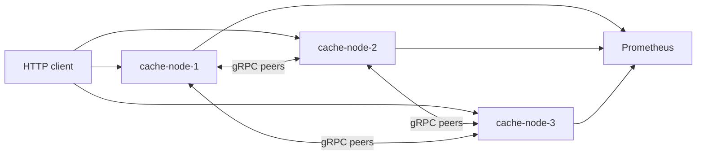

# DistCache

DistCache is a small distributed in-memory cache written in Go. It runs the same cache node process three times, assigns keys with consistent hashing, stores values in memory with TTL and LRU eviction, and copies each write to one replica. I kept the design intentionally narrow so the routing, replication, and failover behavior are easy to inspect.

The project is meant as a backend systems portfolio piece, not a Redis replacement. It avoids consensus, persistence, dynamic membership, and authentication so the core data flow stays readable.

## Why I Built It

I wanted a compact project that exercises the parts of a distributed service that are easy to talk about but easy to hand-wave: ownership, replica placement, bounded background work, health checks, timeouts, and honest failure behavior. The implementation favors simple code paths over pretending to solve every distributed systems problem.

## What It Supports

- Three cache nodes through Docker Compose
- Static cluster membership from environment variables
- Consistent hashing with virtual nodes
- Replication factor of two
- Asynchronous replication through a bounded worker pool
- TTL expiration and LRU eviction
- Reads from a replica when the primary is marked unhealthy
- Basic recovery sync when a peer becomes healthy again
- HTTP client API and gRPC peer API
- Prometheus metrics, structured logs, and a small admin dashboard
- Unit tests, in-process integration tests, a resilience script, and a load-test script

## Architecture

See [docs/architecture.mmd](docs/architecture.mmd) for the diagram source.



Normal write flow:

1. A client sends a request to any node.
2. That node hashes the key and finds the owner on the ring.
3. If the owner is a peer, the request is forwarded over gRPC.
4. The owner writes to its local in-memory cache.
5. The write is queued for replication to the next healthy node.
6. The client gets a response after the owner write succeeds, not after the replica confirms.

Read flow is similar, except a node will try a healthy replica when the primary is marked unhealthy. That helps availability for replicated keys, but it does not provide strong consistency.

## Running Locally

Requirements:

- Go 1.22 or newer
- Docker with Compose support

Start the cluster:

```bash
docker compose up --build
```

Useful URLs:

- Node 1 dashboard: <http://localhost:8081/admin>
- Node 2 dashboard: <http://localhost:8082/admin>
- Node 3 dashboard: <http://localhost:8083/admin>
- Prometheus: <http://localhost:9095>

Run one node directly:

```bash
go run ./cmd/server
```

## Trying It

Set a value:

```bash
curl -X PUT http://localhost:8081/cache/session:f93d2 \
  -H "Content-Type: application/json" \
  -d '{"value":"active","ttl_seconds":120}'
```

Read it through another node:

```bash
curl http://localhost:8082/cache/session:f93d2
```

Delete it:

```bash
curl -X DELETE http://localhost:8083/cache/session:f93d2
```

Check cluster health:

```bash
curl http://localhost:8081/cluster/health
```

## HTTP API

- `PUT /cache/{key}`
- `GET /cache/{key}`
- `DELETE /cache/{key}`
- `GET /cluster/health`
- `GET /health/live`
- `GET /health/ready`
- `GET /metrics`

Errors use one response shape:

```json
{
  "error": {
    "code": "NODE_UNAVAILABLE",
    "message": "The key owner is currently unavailable."
  }
}
```

## Configuration

The Docker Compose file uses these defaults:

```env
NODE_ID=cache-node-1
HTTP_PORT=8080
GRPC_PORT=9090
CLUSTER_NODES=cache-node-1:9090,cache-node-2:9090,cache-node-3:9090

CACHE_MAX_ENTRIES=10000
DEFAULT_TTL=300s
CACHE_CLEANUP_INTERVAL=5s
MAX_VALUE_BYTES=1048576

VIRTUAL_NODES=100
REPLICATION_FACTOR=2
REPLICATION_WORKERS=8
REPLICATION_QUEUE=1000
REPLICATION_RETRIES=3

HEALTH_CHECK_INTERVAL=2s
HEALTH_CHECK_TIMEOUT=500ms
HEALTH_FAILURE_THRESHOLD=3
HEALTH_RECOVERY_THRESHOLD=2
REQUEST_TIMEOUT=750ms

GRACEFUL_SHUTDOWN_TIMEOUT=10s
RECOVERY_SYNC_BATCH_SIZE=250
RECOVERY_SYNC_TIMEOUT=30s
MAX_CONCURRENT_RECOVERY=2

HTTP_READ_TIMEOUT=3s
HTTP_WRITE_TIMEOUT=5s
HTTP_IDLE_TIMEOUT=30s
MAX_FORWARDING_HOPS=1
```

`CLUSTER_NODES` accepts `host:port` entries, where the host is also the node ID, or explicit `node-id=host:port` entries.

## Metrics And Dashboard

Prometheus scrapes `/metrics`. Metrics include request counts, cache hits and misses, entry count, evictions, expired entries, replication successes and failures, failovers, node health, and HTTP/gRPC duration summaries. Labels are limited to operation, node, and status. Cache keys are not used as labels.

The dashboard at `/admin` reads from the node's admin API. It shows cluster status, entry counts, hit ratio, request count, evictions, replication/failover failures, memory usage through the stats endpoint, and recent events from the in-memory event log.

## Testing

```bash
make test
make test-unit
make test-integration
make test-race
make lint
make coverage
make verify
```

The repository includes tests for cache operations, TTL expiration, LRU eviction, concurrent cache access, consistent hashing, replica selection, health transitions, replication retries, HTTP behavior, forwarding, metrics, and replica reads during a primary failure.

`make verify` runs the normal test suite, the race detector, `go vet`, and the coverage command. A Go toolchain is required for these commands.

## Failure Test

The resilience script starts the Compose cluster, writes 1,000 keys, waits for replication metrics to catch up, stops `cache-node-2`, checks read availability, performs 100 writes during the outage, restarts the node, and prints the observed results.

```bash
make resilience-test
```

The script prints measured values. The README does not include a claimed result because results depend on the machine and the run.

## Load Test

```bash
make load-test
```

The load script runs a 60-second workload with 50 workers, a 10,000-key space, 60% GET, 30% SET, and 10% DELETE. Values are between 100 bytes and 1 KB. It reports request count, request rate, average latency, p50, p95, p99, error rate, cache hit ratio, replication failures, and failovers.

Use [docs/benchmark-results-template.md](docs/benchmark-results-template.md) to record actual local results.

## Design Choices

Consistent hashing keeps ownership stable when a node is removed or added back. The implementation uses virtual nodes to avoid one physical node receiving too much of the key space.

Replication is asynchronous. That keeps client writes from waiting on a slow replica, but it also means a very recent write can be lost if the owner fails before the replica receives it.

Health checks use consecutive success and failure thresholds so a short timeout does not immediately move traffic. This is simple and practical for a local cluster, but it does not solve split-brain behavior.

Cluster membership is static because dynamic membership would introduce a separate coordination problem. The project already has enough moving parts with ownership, replication, and recovery.

LRU eviction was chosen because it is easy to reason about with a map plus a linked list, and it gives the cache a realistic capacity limit without adding a second policy.

## Limitations

- Values are stored only in memory.
- Replication is asynchronous, so temporary inconsistency is expected.
- A recent write can be lost during a narrow owner-failure window.
- Nodes can temporarily disagree about peer health.
- Cluster membership is static.
- Recovery synchronization is best-effort and basic.
- There is no distributed consensus.
- The dashboard has no authentication.
- The gRPC transport uses a compact JSON codec while `proto/cache.proto` documents the intended service contract.
- Validation is designed around local tests and Docker Compose, not production traffic.

## What I Would Improve Next

- Add read repair after replica reads.
- Make recovery synchronization more complete and easier to observe.
- Test network partitions more thoroughly.
- Replace static membership with a small, explicit membership protocol.

## Resume Notes

See [docs/resume.md](docs/resume.md) for a short resume-ready summary based only on repository functionality.
