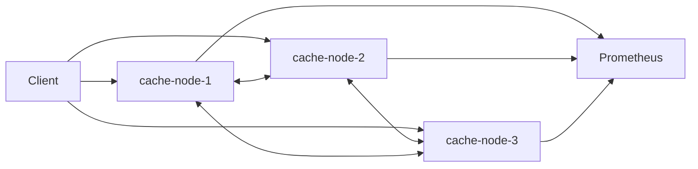

# DistCache

DistCache is a compact, production-inspired distributed in-memory cache written in Go. It is intentionally small enough to study, run locally, and discuss in interviews, while still covering the backend engineering pieces that make distributed systems interesting: consistent hashing, replication, failover, TTL expiration, LRU eviction, gRPC inter-node traffic, metrics, structured logs, and a small admin dashboard.

## Architecture



Each node runs the same binary:

- HTTP API for client requests and admin views
- gRPC server for inter-node reads, writes, replication, health checks, and sync
- Thread-safe in-memory cache with TTL cleanup and LRU eviction
- Consistent hashing ring with virtual nodes
- Background health checker and asynchronous replication workers
- Prometheus-compatible metrics endpoint at `/metrics`

## Request Flow

Clients can talk to any node. The receiving node hashes the key, finds the primary owner, and either serves the request locally or forwards it to the owner over gRPC. Writes are stored on the selected owner and asynchronously replicated to the next healthy node on the ring. Reads try the healthy primary first and then the replica when needed.

## Consistent Hashing

The hash ring uses CRC32 and configurable virtual nodes (`VIRTUAL_NODES`, default `100`). A key maps to the first virtual node clockwise on the ring. Replica placement walks clockwise until it finds a different physical node. Removing a node remaps only the keys owned by that node.

## Replication And Failover

DistCache uses primary-replica replication with a default replication factor of two. Replication is asynchronous: a write succeeds after the selected owner writes locally, then a bounded worker pool attempts replica writes with short retries.

If a primary is unhealthy, writes fail over to the next healthy node on the ring and reads try healthy replicas. Recovered nodes are marked healthy after multiple successful checks and receive a simple best-effort synchronization of entries they should own.

Consistency model: eventual consistency. DistCache does not implement quorum reads/writes, distributed transactions, or consensus.

## Local Setup

Run the cluster:

```bash
docker compose up --build
```

Services:

- Node 1 dashboard: <http://localhost:8081/admin>
- Node 2 dashboard: <http://localhost:8082/admin>
- Node 3 dashboard: <http://localhost:8083/admin>
- Prometheus: <http://localhost:9095>

Run a single node without Docker:

```bash
go run ./cmd/server
```

## API Examples

Set a value:

```bash
curl -X PUT http://localhost:8081/cache/user:101 \
  -H "Content-Type: application/json" \
  -d '{"value":"example value","ttl_seconds":300}'
```

Get a value:

```bash
curl http://localhost:8082/cache/user:101
```

Delete a value:

```bash
curl -X DELETE http://localhost:8083/cache/user:101
```

Cluster health:

```bash
curl http://localhost:8081/cluster/health
```

## Configuration

Common environment variables:

```env
NODE_ID=cache-node-1
HTTP_PORT=8080
GRPC_PORT=9090
CLUSTER_NODES=cache-node-1:9090,cache-node-2:9090,cache-node-3:9090
CACHE_MAX_ENTRIES=10000
CACHE_CLEANUP_INTERVAL=5s
REPLICATION_FACTOR=2
VIRTUAL_NODES=100
HEALTH_CHECK_INTERVAL=2s
REQUEST_TIMEOUT=800ms
```

`CLUSTER_NODES` accepts either `host:port` entries, where the host is also the node ID, or explicit `node-id=host:port` entries.

## Metrics

Prometheus scrapes `/metrics`. Exported metrics include:

- `distcache_requests_total`
- `distcache_cache_hits_total`
- `distcache_cache_misses_total`
- `distcache_cache_entries`
- `distcache_evictions_total`
- `distcache_expired_entries_total`
- `distcache_replication_success_total`
- `distcache_replication_failures_total`
- `distcache_failovers_total`
- `distcache_node_health`
- `distcache_request_duration_seconds`
- `distcache_grpc_request_duration_seconds`

Labels are limited to node, operation, and status. Cache keys are never used as labels.

## Testing

```bash
make test
make test-unit
make test-integration
make test-race
make lint
```

The unit tests cover cache operations, TTL expiration, LRU eviction, concurrent access, consistent hashing, replica selection, node removal, and health transitions. The in-process integration tests start three local nodes and verify forwarding through a non-owner node, primary reads, asynchronous replication, replicated deletes, TTL expiration across replicas, and replica reads when a primary is unavailable.

Run the Docker-based resilience script after starting the cluster:

```bash
make resilience-test
```

Example output:

```text
Keys inserted: 100
Keys available before failure: 100
Node stopped: cache-node-2
Keys available during failure: 96
Successful writes during failure: 20
Node recovery detected: true
Final healthy nodes: 3/3
```

Some keys can be temporarily unavailable during failure because replication is asynchronous and the system does not use quorum reads or write-ahead persistence.

Run the load test:

```bash
make load-test
```

The load generator sends a 60% GET, 30% SET, 10% DELETE workload across the three HTTP nodes and reports request rate, average latency, p95 latency, and error rate.

## Limitations

- Static cluster membership
- No persistent storage
- No distributed consensus
- Temporary inconsistency is possible
- Basic best-effort node synchronization
- No authentication
- gRPC transport uses a compact JSON codec while `proto/cache.proto` documents the service contract
- Designed as an educational production-inspired system, not a Redis or Memcached replacement

## Future Improvements

- LFU eviction
- Configurable consistency modes
- Write quorum and read repair
- Dynamic node registration
- Redis-compatible command interface
- Admin authentication
- Grafana dashboard
- OpenTelemetry tracing
- Append-only persistence
- Kubernetes manifests
